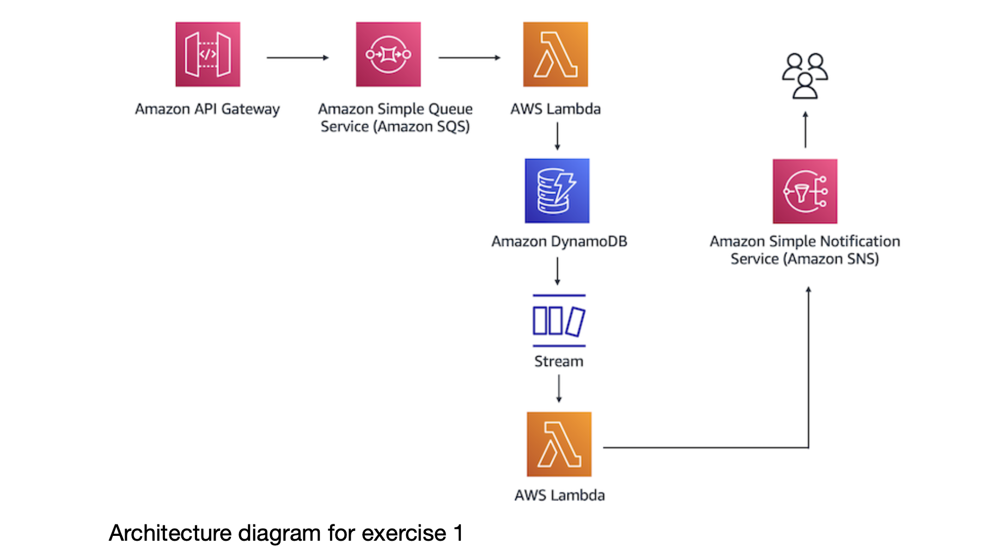

# Getting Started
## Exercise 1. Architecting Solutions: Building a Proof of Concept for a Serverles Solution

Suppose you have a customer that needs a serverless web backend hosted on AWS. The
customer sells cleaning supplies and often sees spikes in demand for their website, which
means that they need an architecture that can easily scale in and out as demand changes.
The customer also wants to ensure that the application has decoupled application
components.
The following architectural diagram shows the flow for the serverless solution that you will
build.

 This exercise is adapted from a Coursera AWS serverless architecture lab and implemented locally using LocalStack and Terraform for learning purposes. The goal is to understand the architecture and workflow without paying for real AWS services.
 
 

## Overview

Since LocalStack does not enforce IAM the same way real AWS does, we can skip the custom IAM policies and roles from Task 1. In LocalStack Community Edition, the default Lambda role typically has open permissions, so that part becomes a non-issue. The rest of the architecture still maps cleanly to AWS services:

- DynamoDB
- SQS
- Lambda x2
- DynamoDB Streams
- SNS
- API Gateway

## Roadmap

We will follow this sequence step by step:

1. Project setup — folder structure and LocalStack + Terraform configuration
2. DynamoDB table with Streams enabled: `orders`
3. SQS queue: `POC-Queue`
4. SNS topic and email subscription: `POC-Topic`
5. Lambda #1 — SQS to DynamoDB writer, including event source mapping
6. Lambda #2 — DynamoDB Streams to SNS publisher, including event source mapping
7. API Gateway REST API — `POST` to SQS integration
8. End-to-end validation using `curl` and monitoring the flow of data
9. Final consolidated `main.tf` containing everything together

## Step 1: Project Setup

Make sure the following are available:

- Docker Desktop running
- Terraform CLI
- Python 3 installed
- A virtual environment for the project

### Recommended setup

Do not install the LocalStack CLI with `pip` for this lab. That path can trigger the license/auth issue. Instead, create a venv and install only the Python helper tools you need for local AWS testing:

```bash
cd "<your path>"

python3 -m venv .venv
source .venv/bin/activate
python3 -m pip install --upgrade pip
python3 -m pip install terraform-local awscli-local
```

awslocal = local dev/testing <br>
aws = real cloud environment <br>
e.g LocalStack :awslocal sqs list-queues <br>
Real AWS: aws sqs list-queues <br>

The AWS CLI is the actual tool. awslocal is just a wrapper/alias typically installed via: pip install awscli-local <br>

Then run LocalStack through Docker using a compatible image tag:

```bash
docker rm -f localstack 2>/dev/null || true

docker run -d \
  --name localstack \
  -p 4566:4566 \
  -p 4510-4559:4510-4559 \
  localstack/localstack:3.8
```

### Verify LocalStack is running

```bash
docker ps
docker logs localstack --tail 100
curl -s http://localhost:4566/_localstack/health
```

A successful response should look similar to this:

```json
{"features": {"initScripts": "initialized"}, "services": {"dynamodb": "available", "sns": "available", "sqs": "available", "lambda": "available"}, "version": "1.4.0"}
```

### LocalStack service status

```bash
localstack status services
```

```text
Service                   Status
------------------------  ---------
acm                       available
apigateway                available
...
...
```

### Why this setup is correct

- The Python venv is only for local tooling such as `terraform-local` and `awscli-local`.
- LocalStack itself runs in Docker.
- The Docker image tag `localstack/localstack:1.4` matches the working version confirmed in this lab.
- This avoids the CLI license/auth issue that happens with newer LocalStack start flows.

## Important note

LocalStack needs Docker Desktop running, so make sure Docker is installed and started before launching the container.

This project is designed to simulate the AWS flow locally while keeping the configuration simple and practical. The goal is to validate the architecture end-to-end without needing the full AWS IAM model in LocalStack.

## Notes

This setup is designed to simulate the AWS flow locally while keeping the configuration simple and practical. The goal is to validate the architecture end-to-end without needing the full AWS IAM model in LocalStack.

## Follow below steps to stop docker and come back next day with the installations intact

1) Stop and remove the current LocalStack container
docker rm -f localstack 2>/dev/null || true <br>
If you only want to pause it temporarily instead of deleting it: 
docker stop localstack <br>
Then later:  docker start localstack <br>

2) Reuse the same virtual environment <br>
From your project folder: <br>
cd /path/to/Exercise1
source .venv/bin/activate

3) Start LocalStack again <br>
docker run -d \
  --name localstack \
  -p 4566:4566 \
  -p 4510-4559:4510-4559 \
  localstack/localstack:1.4

Check it is healthy:<br>
curl -s http://localhost:4566/_localstack/health


## Folder structure we will build

```text
Exercise1/
├── main.tf                   # providers + LocalStack config
├── variables.tf              # optional shared vars
├── dynamodb.tf               # Step 2
├── sqs.tf                    # Step 3
├── sns.tf                    # Step 4
├── lambda1/
│   └── lambda_function.py    # Step 5
├── lambda2/
│   └── lambda_function.py    # Step 6
├── lambda.tf                 # Step 5 & 6 resources
├── api_gateway.tf            # Step 7
```

## Step 1: Create main.tf <refer the main.tf file>
- run : terraform init <below is the o/p>
``` text Initializing the backend...
Initializing provider plugins...
- Finding hashicorp/aws versions matching "~> 5.0"...
- Installing hashicorp/aws v5.100.0.
...
Terraform has been successfully initialized!
```

## Step 1.1 : What the PDF exercise asks you to do (Task 1)
Analogy: AWS = big office building. Every service (Lambda, DynamoDB, SQS...) is a room.<br> 
IAM is the security badge system — it decides who can walk into which room and what they're allowed to touch in there. <br>
A role = a badge. A policy = the list of doors that badge can open. <br>
On real AWS, if your Lambda function tries to write to DynamoDB but has no badge (role) that allows it, AWS will block it with a "permission denied" error. So the PDF has you: <br>

Create 4 separate policies (door-lists) — one for "can write to DynamoDB," one for "can publish to SNS," one for "can read DynamoDB Streams," one for "can read SQS." <br>
Create 3 separate roles (badges), each badge getting 1-2 of those policies attached, so each Lambda/API Gateway only has exactly the doors it needs and nothing more. <br>

This is called "least privilege" — give each component the minimum access it needs, in case something gets compromised. It's a real-world AWS best practice. <br>

<h4> Why we're skipping most of that </h4> <br>

We're not running on real AWS — we're running LocalStack, a fake/mock version of AWS on your own laptop for testing. LocalStack (especially the free Community edition we're using) doesn't actually check permissions at all. Even with zero IAM setup, your Lambda function could write to DynamoDB, publish to SNS, whatever — LocalStack just lets it happen. <br>

So creating those 4 careful policies + 3 careful roles would be pure busywork here — it teaches you nothing extra locally, because nothing is enforcing them anyway. <br>
Note: even though LocalStack doesn't check the badge, when you create a Lambda function, AWS's API (and LocalStack, which mimics that API) requires you to hand it a badge-shaped object — it just never looks at what's printed on it. If you don't pass a role ARN at all, Terraform will error out, because that field is mandatory in the API request format.
<br>

  -  iam role  : iam.tf refer this file 
## Step 2: the DynamoDB table with Streams enabled 
- - dynamodb.tf refer this file 


Let's apply now so you can see it work before we add more pieces: <br>
terraform apply <br>
Type yes when prompted. <br>
You should see aws_iam_role.local_exec_role, the policy attachment, and aws_dynamodb_table.orders created.
``` text
aws_iam_role.local_exec_role: Creating...
aws_dynamodb_table.orders: Creating...
aws_iam_role.local_exec_role: Creation complete after 2s [id=local-exec-role]
aws_iam_role_policy_attachment.local_exec_admin: Creating...
aws_iam_role_policy_attachment.local_exec_admin: Creation complete after 0s 
```

- - Verify it worked: <br>

awslocal dynamodb list-tables <br>
``` text o/p:
{
    "TableNames": [
        "orders"
    ]
}
```
awslocal dynamodb describe-table --table-name orders --query "Table.StreamSpecification"
``` text o/p:
{
    "StreamEnabled": true,
    "StreamViewType": "NEW_AND_OLD_IMAGES"
}
```
## Step 3: Amazon SQS Queue

Creating an SQS queue (single unnumbered task, no sub-steps in the PDF).

1. Open the SQS console and choose Create queue.
2. Configure:
   - Name: `POC-Queue`
   - Access Policy: Basic
   - Restrict who can send messages → only the APIGateway-SQS role
   - Restrict who can receive messages → only the Lambda-SQS-DynamoDB role
3. Choose Create queue.

### LocalStack workaround

The "Access Policy" restrictions exist to enforce that only API Gateway can send and only Lambda can receive — this is IAM-based access control on the queue itself, same category as Task 1. Since LocalStack does not enforce these policies, we skip the access policy restrictions entirely and create a plain, open queue. Functionally identical for this PoC, since nothing else will be interacting with this queue except our own resources anyway.

- `sqs.tf` → refer this file
- Apply & verify: `terraform apply`

You should see `aws_sqs_queue.poc_queue` added, on top of the DynamoDB table and IAM role from before.

Verify:

```bash
awslocal sqs list-queues
```

Example output:

```json
{
  "QueueUrls": [
    "http://sqs.us-east-1.localhost.localstack.cloud:4566/000000000000/POC-Queue"
  ]
}
```

> Note: If SQS or any other service gives an error, try the following reset sequence:

```bash
docker rm -f localstack 2>/dev/null || true
docker run -d \
  --name localstack \
  -p 4566:4566 \
  -p 4510-4559:4510-4559 \
  -v /var/run/docker.sock:/var/run/docker.sock \
  -e DOCKER_HOST=unix:///var/run/docker.sock \
  -e LAMBDA_EXECUTOR=docker \
  localstack/localstack:3.8
docker ps
docker logs localstack --tail 100
curl -s http://localhost:4566/_localstack/health
cd /path/to/Exercise1
# rm -rf .terraform .terraform.lock.hcl terraform.tfstate* # not necessary to delete everytime 
terraform init
terraform apply
```

## Step 4: Lambda function 1 (SQS → DynamoDB)
In this task, you create a Lambda function that reads messages from the SQS queue and
writes an order record to the DynamoDB table. <br>
### Step 4.1 — Creating the Lambda function

Console → Lambda → Create function → name POC-Lambda-1, runtime Python 3.9, execution role = Lambda-SQS-DynamoDB <br>

Terraform equivalent: a Lambda function resource, but Lambda needs your code as a zip file, not raw text — so first the code, then the resource.

Create the folder and file: mkdir -p lambda1 <br>
create lambda_function.py :refer the file <br>

Now lambda.tf <refer this file>—  (create function) and Step 4.2 (SQS trigger) together:<br>

**Note** on Step 4.3 ("Adding and deploying the function code"): in the Exercise this is a separate manual step (paste code → Deploy button) because the console makes you create the function empty first, then edit its code. Terraform does both in one shot — the filename/source_code_hash in the resource above is the deploy step. No separate action needed. <br>

You'll need the archive_file provider — add this to main.tf's required_providers block:
``` text
    archive = {
      source  = "hashicorp/archive"
      version = "~> 2.4"
    }
```
Then re-run: <br>
terraform init    <br>
terraform apply    <br>

### Step 4.4 — Testing the Lambda function

PDF asks: Console → Test tab → SQS template → run test manually <br>
LocalStack workaround: no console, so we invoke it directly via CLI instead: <br>

awslocal lambda invoke \
  --function-name POC-Lambda-1 \
  --payload '{"Records":[{"body":"Hello from SQS!"}]}' \
  --cli-binary-format raw-in-base64-out \
  output.json 
<br><br>

It does this:<br>
a.calls the Lambda function named POC-Lambda-1 <br>
b.passes this event JSON as input: "Records":[{"body":"Hello from SQS!"}] <br>
c. runs the function in LocalStack <br>
d. stores the Lambda response in a file named output.json <br>

below is the o/p <br>
``` text 
{
    "StatusCode": 200,
    "ExecutedVersion": "$LATEST"
}
```

cat output.json <br>
show: null%   # This is because the Lambda function returns no explicit Python value.  <br>

awslocal logs tail /aws/lambda/POC-Lambda-1 --follow <br>
2026-08-30T05:47:18.578000+00:00 2026/08/30/[$LATEST]024aec15068a5ff939af6d951aba2ea4 START RequestId: 4647148a-a0b6-4979-bef7-f87a0693d68f Version: $LATEST <br>
2026-08-30T05:47:18.605000+00:00 2026/08/30/[$LATEST]024aec15068a5ff939af6d951aba2ea4 Received record: {'body': 'Hello from SQS!'}<br>
...

### Step 4.5 — Verifying the item landed in DynamoDB

awslocal dynamodb scan --table-name orders <br>
``` text {
    "Items": [
        {
            "orderID": {
                "S": "d245d706-6341-4136-aee7-141f1c8a3537"
            },
            "order": {
                "S": "Hello from SQS!"
            }
        }
    ],
    "Count": 1,
    "ScannedCount": 1,
    "ConsumedCapacity": null
}
```
So the Lambda logic is working as intended. <br>


## Step 5: Enabling DynamoDB Streams

Thhis step was folded into Step 2 back when we created the orders table — the stream_enabled and stream_view_type arguments in dynamodb.tf are exactly what Task 5's console steps do. Nothing new to run here.

## Step 6: Creating an SNS topic and subscription

In this task, you create an SNS topic and set up subscriptions. Amazon SNS coordinates
and manages delivering or sending messages to subscriber endpoints or clients.

### Step 6.1 — Creating the topic
PDF asks: Console → SNS → Create topic → name POC-Topic, type Standard

### Step 6.2 — Subscribing to email notifications

PDF asks: Subscriptions tab → Create subscription → Protocol: Email → Endpoint: your email → confirm via inbox

LocalStack workaround <br>

LocalStack's Community edition does not send real emails — the email protocol subscription is accepted by the API but nothing actually lands in your inbox, and there's no confirmation flow to click. So we'll still create the email subscription (to mirror the PDF faithfully), but we won't rely on it to prove the pipeline works — instead we'll check LocalStack's logs to confirm SNS received and "sent" the notification.

Create sns.tf  - refer this file <br>
terraform apply  : type yes when prompted <br>
Verify : awslocal sns list-topics <br> below is the o/p <br>
``` text 
{
    "Topics": [
        {
            "TopicArn": "arn:aws:sns:us-east-1:000000000000:POC-Topic"
        }
    ]
}
```
Check the subscription too:<br>
awslocal sns list-subscriptions <br> below is the o/p <br>
``` text
{
    "Subscriptions": [
        {
            "SubscriptionArn": "arn:aws:sns:us-east-1:000000000000:POC-Topic:edbf29e7-1680-424e-aeec-8143b30d7205",
            "Owner": "000000000000",
            "Protocol": "email",
            "Endpoint": "john@zoho.com",
            "TopicArn": "arn:aws:sns:us-east-1:000000000000:POC-Topic"
        }
    ]
}
```
In some cases it might say "PendingConfirmation" forever, since there's no real email to confirm. That's expected and fine for our purposes. <br>

## Step 7: Creating Lambda #2 (DynamoDB Streams → SNS)

In this task, you create a Lambda function for the Lambda-DynamoDBStreams-SNS role.
The second Lambda function uses DynamoDB Streams as a trigger to pass the record of a
new entry to Amazon SNS. <br>

API → SQS → Lambda 1 → DynamoDB → (stream) → Lambda 2 → SNS → Email <br>
Lambda 1 (Task 4) handles the first half: takes a message off the queue, writes it into DynamoDB. That's it. Its job ends the moment the item is saved.

But the customer also wants a notification every time a new order comes in. DynamoDB itself has no concept of "notify someone" — it just stores data. So we need something watching the table, noticing new items appear, and reacting to them.

That's exactly what DynamoDB Streams does — it's like a security camera pointed at the table that records "something changed" events (we turned this camera on back in Step 2/Task 5). But a camera alone doesn't do anything — you need someone watching the footage and acting on it. That's Lambda 2.

So Task 7, does three things:

  - Creates a second, separate Lambda function (POC-Lambda-2) — separate from Lambda 1 because it has a completely different job: it doesn't touch SQS or write to DynamoDB, it reads Stream events and talks to SNS.
  - Wires it to the DynamoDB Stream as a trigger — "run this function automatically every time something is added/changed in the orders table."
  - Its code publishes to SNS — takes the new record DynamoDB just handed it, and hands it off to SNS, which is responsible for actually emailing someone.

### Step 7.1 — Creating the POC-Lambda-2 function

PDF asks: Console → Lambda → Create function → name POC-Lambda-2, runtime Python 3.9, role Lambda-DynamoDBStreams-SNS

### Step 7.2 — Setting up DynamoDB as a trigger

PDF asks: Add trigger → DynamoDB → table orders

### Step 7.3 — Configuring the function code

PDF asks: paste code, replacing the placeholder TargetArn with the real SNS topic ARN

Create the folder and file <br>
mkdir -p lambda2 <br>

lambda2/lambda_function.py — same logic as the PDF's Step 7.3 code, but instead of hardcoding the ARN as a placeholder string, we use an environment variable (Terraform will inject the real ARN automatically — cleaner than manually pasting it like the PDF does):

Now add to lambda.tf (append below your existing poc_lambda_1 resources — same file):
refer <section lambda 2>  archive_file lambda2_zip  and Step 7.1 &  Step 7.2: in lambda.tf

**Note** on Step 7.3: the PDF has you manually edit the TargetArn placeholder in the console after pasting code. We've replaced that with os.environ['SNS_TOPIC_ARN'] in the Python + the environment block in Terraform — same end result, but no manual string-editing, and it stays correct even if the topic gets recreated.

then: terraform apply , type yes when prompted 

### Step 7.4 — Testing

PDF asks: Console Test tab, DynamoDB-Update template, manual Test button, then check inbox for email.

LocalStack workaround: No console test button, and no real email will arrive (same reasoning as Task 6). Instead, we'll trigger it for real by writing a new item to orders directly — this actually exercises the full trigger chain (DynamoDB Stream → Lambda 2 → SNS), unlike a synthetic console test event.

Go to Exercise1 folder <br>
awslocal dynamodb put-item \
  --table-name orders \
  --item '{"orderID": {"S": "test-order-999"}, "order": {"S": "manual stream test"}}'

Then check that Lambda 2 actually ran and called SNS: <br>
awslocal logs tail /aws/lambda/POC-Lambda-2 --since 2m  <br>
gives below o/p  <br>
2026-08-30T07:03:07.474000+00:00 2026/08/30/[$LATEST]a72fcd3fa329336d8b83415cf7455db7 START RequestId: 46fd0011-29f5-405a-831e-3c47f6b99827 Version: $LATEST <br>
2026-08-30T07:03:07.480000+00:00 2026/08/30/[$LATEST]a72fcd3fa329336d8b83415cf7455db7 END RequestId: 46fd0011-29f5-405a-831e-3c47f6b99827 <br>
2026-08-30T07:03:07.486000+00:00 2026/08/30/[$LATEST]a72fcd3fa329336d8b83415cf7455db7 REPORT RequestId:46fd0011-29f5-405a-831e-3c47f6b99827    Duration: 80.97 ms      Billed Duration: 81 ms  Memory Size: 128 MB     Max Memory Used: 128 MB <br>


Look for no error traceback — a clean run means the function executed and called sns.publish() without exceptions. LocalStack Community won't show you a "confirmed email sent" log line (that's Pro-tier observability), but a clean Lambda execution with no errors is your confirmation the chain worked end-to-end. <br>

If you want to double check the event source mapping is actually attached and enabled: <br>
awslocal lambda list-event-source-mappings --function-name POC-Lambda-2 <br>
``` text
{
    "EventSourceMappings": [
        {
            "UUID": "01a53b1c-9d8e-4635-a03d-cd5556433de5",
            "StartingPosition": "LATEST",
            "BatchSize": 100,
            "MaximumBatchingWindowInSeconds": 0,
            "ParallelizationFactor": 1,
            "EventSourceArn": "arn:aws:dynamodb:us-east-1:000000000000:table/orders/stream/2026-08-30T05:46:18.100",
            "FunctionArn": "arn:aws:lambda:us-east-1:000000000000:function:POC-Lambda-2",
            "LastModified": "2026-08-30T12:29:10.534279+05:30",
            "LastProcessingResult": "No records processed",
            "State": "Enabled",
            "StateTransitionReason": "User action",
```

Look for "State": "Enabled". as above <br>

### What we did, concretely
  - Wrote lambda2/lambda_function.py: loops through incoming stream records, and for any INSERT event, calls sns.publish() to send that record to the SNS topic.
  - Created the Lambda function resource itself, pointing at that code.
  - Created the event source mapping — this is the literal "trigger" wiring: it tells AWS/LocalStack "watch orders' stream, and whenever something shows up, invoke POC-Lambda-2 automatically."
  - Instead of the PDF's manual copy-paste of the SNS topic ARN into the code, we passed it in as an environment variable so Terraform keeps it accurate automatically.

## Step 8: Creating an API with Amazon API Gateway

In this task, you create a REST API in Amazon API Gateway. The API serves as a
communication gateway between your application and the AWS services.

Step back and look at the whole chain we've built so far: <br>
??? → SQS → Lambda 1 → DynamoDB → Lambda 2 → SNS <br>
Everything from SQS onward is done and tested. But there's a gap at the very front: how does an order actually get into SQS in the first place? So far, the only way we've put things into the pipeline is by typing awslocal commands ourselves — that's not something a real customer's checkout page can do. A website can't run AWS CLI commands; it can only make an HTTP request (like a normal web form submission).

Task 8's whole objective: give the outside world a normal web URL they can POST to, and have that URL quietly drop the data into SQS — kicking off everything else automatically. That's it. It's the "front door" of the whole system. <br>

Customer's website → [API Gateway URL] → SQS → (rest of the pipeline)

Task 8, steps 1–18 (this is the PDF's longest console task — lots of it collapses in Terraform)

What the PDF's 18 steps do, grouped simply:<br>
  - Steps 1–3: create a new REST API shell named POC-API
  - Steps 4–5: create a POST method on it
  - Step 6: tell that method "when you get a POST, forward it to SQS" (not to a Lambda      directly   straight to the queue, using the APIGateway-SQS role)
  - Steps 7–17: a chunk of plumbing — API Gateway needs to convert an incoming JSON request body into the exact format SQS's SendMessage API expects. That's what the "HTTP Headers" and "Mapping Template" steps are doing — translating one shape of data into another.

LocalStack workaround

Same as before — we skip the APIGateway-SQS role and reuse local_exec_role (created in Step 1). Everything else we build for real, since this is the actual feature under test. <br>

Create api_gateway.tf:  refer to the file<br>
cd <path to Exercise1> <br>
terraform apply  # type yes <br>
Get the invoke URL. <br>
terraform output 2>/dev/null || echo "no outputs defined yet — we'll grab the URL manually" <br>
awslocal apigateway get-rest-apis --query "items[0].id" --output text  <br>
o/p : 6hmm1mtkfd <br>
Copy the ID it prints, then your local invoke URL is:  <br>
e.g http://localhost:4566/restapis/<API_ID>/test/_user_request_ <br>
i.e http://localhost:4566/restapis/6hmm1mtkfd/test/_user_request_

### What each piece of code we wrote actually does on api_gateway.tf:
  - aws_api_gateway_rest_api — this just creates an empty "API" container/shell. Think of it as creating a new empty website — no pages yet, just a name and a place for it to live.
  - aws_api_gateway_method (POST) — defines what kind of request this API will accept at its root address (/). We said "accept POST requests" — same as any web form submission (as opposed to GET, which is for retrieving data, not sending it).
  - aws_api_gateway_integration — this is the actual "wiring." It says: when a POST request arrives here, don't run any of our own code — instead, forward it straight into the SQS queue as a SendMessage call. This is a neat AWS trick: API Gateway can talk directly to other AWS services without needing a Lambda function in between just to relay the message.
  - The header + mapping template bits (request_parameters, request_templates) — this is pure "translation." A customer's website sends a JSON body like {"item": "gloves"}. But SQS's API doesn't understand raw JSON bodies — it expects a very specific format like Action=SendMessage&MessageBody=.... This block automatically rewrites the incoming JSON into that exact format before handing it to SQS. Without it, SQS would reject the request as malformed.
  - method_response / integration_response — bookkeeping so API Gateway knows "when SQS replies, respond back to the customer's website with a 200 OK" — otherwise the customer's browser would just hang waiting for a status code.
  - aws_api_gateway_deployment + aws_api_gateway_stage — this is the "publish" button. Everything above is just a draft configuration until it's deployed to a stage (we called ours test, matching real AWS's habit of naming stages like dev/test/prod). Deploying is what actually makes it reachable at a live URL.

## Task 9: Testing the architecture via API Gateway

In this task, you use API Gateway to send mock data to Amazon SQS as a proof of concept
for the serverless solution.

PDF reference: Task 9, steps 1–3 — send mock data through the API and confirm it flows through the whole chain

What is it asked in Task  does

Uses the console's built-in "Test" button on the POST method, pastes a JSON body, and checks for a 200 response + eventual email.

LocalStack workaround

No console Test button, so we hit the real invoke URL with curl instead — this is actually closer to how a real client would call it anyway.

Run this (from anywhere, since curl doesn't need Terraform/LocalStack context — but staying inside poc-serverless/ is fine too) <br>
curl -X POST \
  "http://localhost:4566/restapis/6hmm1mtkfd/test/_user_request_/" \
  -H "Content-Type: application/json" \
  -d '{"item": "latex gloves", "customerID": "12345"}'

below is o/p <br>
``` text
{"SendMessageResponse": {"SendMessageResult": {"MD5OfMessageBody": "f6e446b4b3521f301fa4402e58426f1b", "MessageId": "6b43cc35-a3d6-44a8-a2da-2f84f402e308"}, "ResponseMetadata": {"RequestId": "6b17805d-5013-4a09-b4f3-8d2256868580"}}}%                                                                               
``` 

#### Now verify the full chain fired, step by step
1. Confirm the message landed in SQS (may already be consumed by the time you check — that's fine, means Lambda 1 already picked it up):

awslocal sqs get-queue-attributes \
  --queue-url http://localhost:4566/000000000000/POC-Queue \
  --attribute-names ApproximateNumberOfMessages

``` text
{
    "Attributes": {
        "ApproximateNumberOfMessages": "0"
    }
} 
```

2. Confirm Lambda 1 ran and wrote to DynamoDB:

awslocal dynamodb scan --table-name orders <br>

``` text
{
    "Items": [
        {
            "orderID": {
                "S": "d3f928ba-ed2b-4a7b-a7bb-6165f883cfa5"
            },
            "order": {
                "S": "{\"item\": \"latex gloves\", \"customerID\": \"12345\"}"
            }
        },
    ...
}
```

Look for a new item with order containing your JSON string ({"item": "latex gloves"...}).

3. Confirm Lambda 2 fired off the back of that new item: <br>
awslocal logs tail /aws/lambda/POC-Lambda-2 --since 10m

2026-08-30T08:39:21.829000+00:00 2026/08/30/[$LATEST]637326b95aac452bd0ed484839a32e65 START RequestId: af357a66-6370-4656-8b1a-6d2c1ed4d608 Version: $LATEST
2026-08-30T08:39:21.837000+00:00 2026/08/30/[$LATEST]637326b95aac452bd0ed484839a32e65 END RequestId: af357a66-6370-4656-8b1a-6d2c1ed4d608
2026-08-30T08:39:21.845000+00:00 2026/08/30/[$LATEST]637326b95aac452bd0ed484839a32e65 REPORT RequestId:af357a66-6370-4656-8b1a-6d2c1ed4d608    Duration: 115.98 ms     Billed Duration: 116 ms Memory Size: 128 MB     Max Memory Used: 128 MB


#### Walking through what actually happened
  1. You sent one curl POST with {"item": "latex gloves", "customerID": "12345"} to your API Gateway URL.
  2. API Gateway → SQS: API Gateway translated your JSON into the format SQS expects and dropped it into POC-Queue — all the "Mapping Template" plumbing from Task 8 did its job silently.
  3. SQS → Lambda 1: Your ApproximateNumberOfMessages: "0" check confirms the queue is now empty — meaning Lambda 1 already picked the message up and processed it (a message count of 0 right after sending is actually a good sign here, not a failure — it means the trigger fired fast).
  4. Lambda 1 → DynamoDB: Your dynamodb scan shows a brand new item with order = the exact JSON string you curled in. This confirms Lambda 1 read the SQS message, generated a UUID, and wrote it into the orders table — exactly as its code does.
  5. DynamoDB Streams → Lambda 2 → SNS: The moment that new item was written, DynamoDB Streams noticed the change and automatically invoked Lambda 2 (you didn't call it — it triggered itself). Your log tail shows a clean START → END → REPORT cycle with no error trace — meaning Lambda 2 successfully read the stream record and called sns.publish() without crashing.

#### Full Picture 
curl (you, acting as the customer)  <br>
   ↓ <br>
API Gateway  (POC-API)               ✅ accepted & translated request <br>
   ↓ <br>
SQS          (POC-Queue)              ✅ received, then drained to 0 <br>
   ↓ <br>
Lambda 1     (POC-Lambda-1)           ✅ wrote new item to DynamoDB <br>
   ↓ <br>
DynamoDB     (orders table)           ✅ new item confirmed via scan <br>
   ↓ (stream) <br> 
Lambda 2     (POC-Lambda-2)           ✅ triggered automatically, ran clean <br>
   ↓ <br>
SNS          (POC-Topic)              ✅ publish() called (email skipped locally, as expected) <br>

## Step 10: Cleanup

PDF reference: Task 10 — manually delete DynamoDB table, both Lambdas, SQS queue, SNS topic + subscription, the API, then IAM roles/policies, all one-by-one via console.

LocalStack + Terraform workaround

Since every single resource we created was defined in Terraform, cleanup isn't a manual multi-step console teardown at all — Terraform already knows about every resource it created (that's what terraform.tfstate tracks) and can remove them all in the correct dependency order with one command.

cd <path to Exercise1 >
terraform destroy
